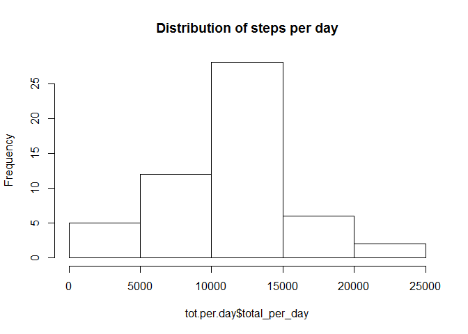
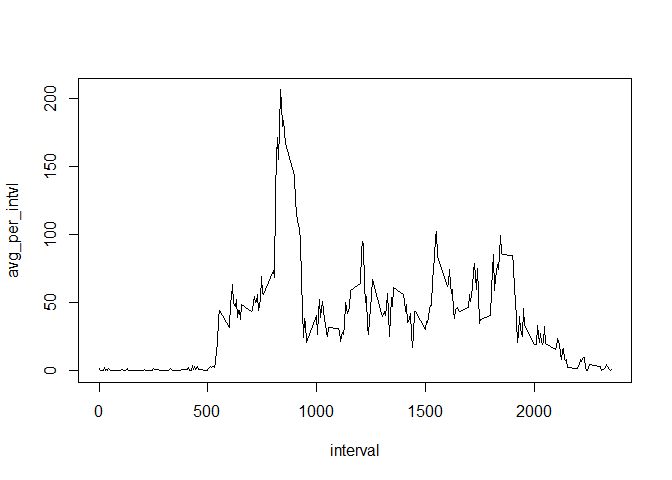
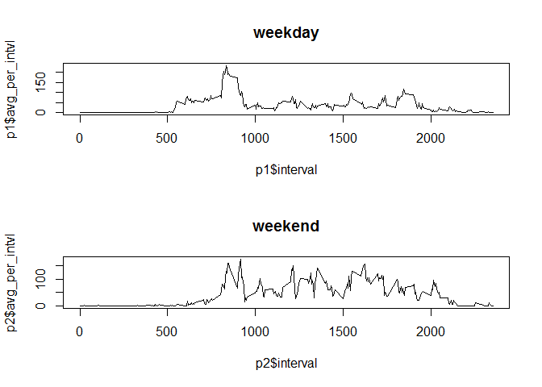

# Reproducible Research: Peer Assessment 1


## Loading and preprocessing the data

```r
ds <- read.csv('activity.csv')
```

## What is mean total number of steps taken per day?
# remove NAs

```r
ds1 <- subset(ds, !is.na(ds$steps))
library(dplyr)
```

```
## Warning: package 'dplyr' was built under R version 3.3.3
```

```
## 
## Attaching package: 'dplyr'
```

```
## The following objects are masked from 'package:stats':
## 
##     filter, lag
```

```
## The following objects are masked from 'package:base':
## 
##     intersect, setdiff, setequal, union
```

```r
ds1 %>%
  group_by(date) %>%
  summarize(total_per_day = sum(steps)) %>% assign("tot.per.day", ., inherits = TRUE)
med.day <- median(tot.per.day$total_per_day)
mean.day <- mean(tot.per.day$total_per_day)
hist(tot.per.day$total_per_day,main='Distribution of steps per day')  
```

<!-- -->

Mean steps per day = 10766  
Median steps per day = 10765

## What is the average daily activity pattern?

```r
ds1 %>%
  group_by(interval) %>%
  summarize(avg_per_intvl = mean(steps)) %>% assign("avg.per.interval", ., inherits = TRUE)
plot(avg.per.interval, type='l')
```

<!-- -->

```r
output <- avg.per.interval[order(avg.per.interval$avg_per_intvl, decreasing=TRUE),]
```
Interval with highest average steps is 835


## Imputing missing values

```r
ds2 <- subset(ds, is.na(ds$steps))
output$avg_per_intvl <- round(output$avg_per_intvl)
ds2 <- merge(ds2, output, by=c('interval'))
ds2$steps <- ds2$avg_per_intvl
ds3 <- rbind(ds1, ds2[c('steps','date','interval')])
ds3 %>%
  group_by(date) %>%
  summarize(total_per_day = sum(steps)) %>% assign("tot.per.day", ., inherits = TRUE)
med.day <- median(tot.per.day$total_per_day)
mean.day <- mean(tot.per.day$total_per_day)
hist(tot.per.day$total_per_day,main='Distribution of steps per day')  
```

<!-- -->

Mean steps per day = 10766  
Median steps per day = 10762  
If we add on the average (mean) at every step where there is missing data, we essentially retain the mean.

## Are there differences in activity patterns between weekdays and weekends?

```r
ds1<- mutate(ds1, DOW.class = substr(weekdays(strptime(ds1$date, "%Y-%m-%d")),1,1) )
```

```
## Warning: package 'bindrcpp' was built under R version 3.3.3
```

```r
ds1<- mutate(ds1, DOW.class = as.factor(ifelse(DOW.class == 'S', 'weekend','weekday')))

ds1 %>%
  group_by(interval,DOW.class) %>%
  summarize(avg_per_intvl = mean(steps)) %>% assign("avg.per.interval", ., inherits = TRUE)
par(mfrow=c(2,1))
p1 <- subset(avg.per.interval, avg.per.interval$DOW.class == 'weekday')
p2 <- subset(avg.per.interval, avg.per.interval$DOW.class == 'weekend')
plot(p1$avg_per_intvl~p1$interval, type='l', main= 'weekday')
plot(p2$avg_per_intvl~p2$interval, type='l', main= 'weekend')
```

<!-- -->

